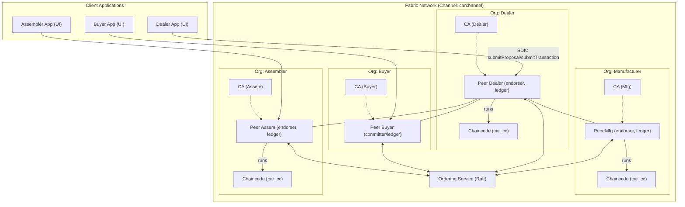
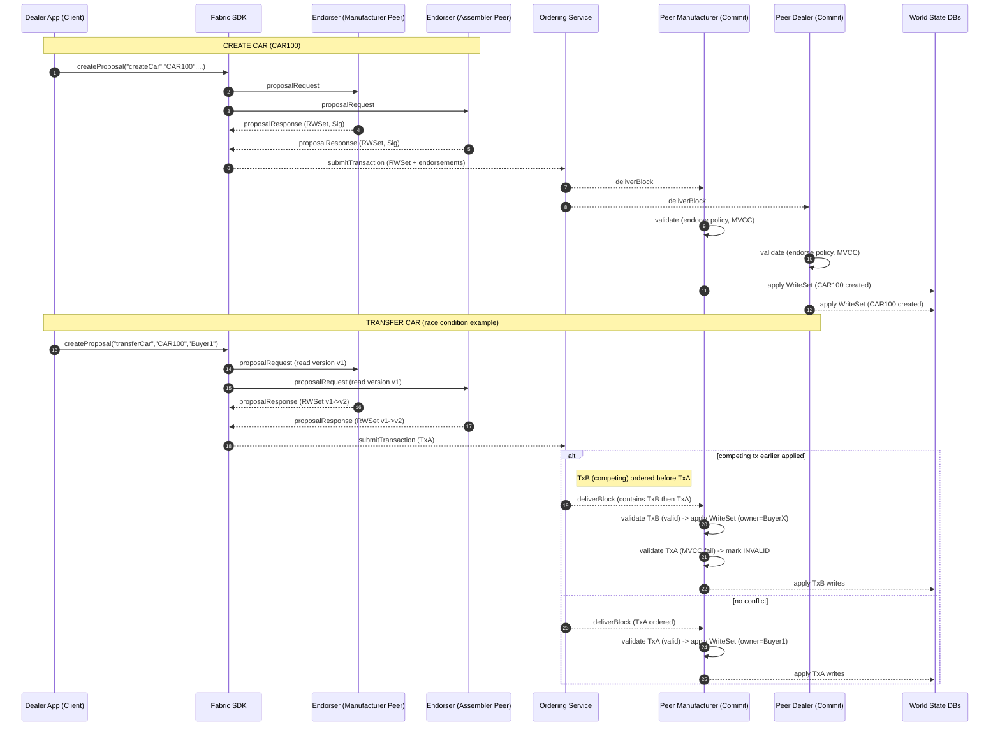
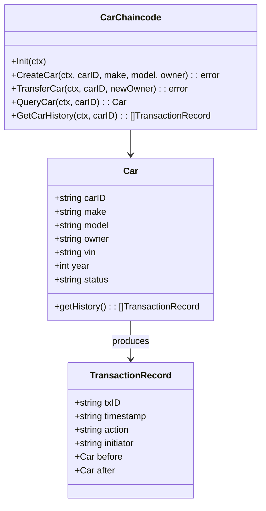

**Car supply-chain** example 

1. A **high-level flowchart** showing orgs, peers, chaincode, CAs, orderer.
2. A **sequence diagram** showing the exact endorsement → ordering → validation sequence for a `createCar` and `transferCar` txn (including invalid path).
3. A simple **UML (class) diagram** for on-chain data model + chaincode interface.

After each diagram a compact explanation and the concrete mapping to Manufacturer / Assembler / Dealer / Buyer.

---

## 1) High-level Flowchart (Architecture + Components)



**Explanation / Mapping**

* `car_cc` is the chaincode (smart contract) deployed/installed on peers of Manufacturer, Assembler, Dealer. Buyer may have a committer peer (no need to endorse).
* Each Org has a CA that issues identity certificates (MSP). Clients (apps) use certs to sign proposals.
* Ordering Service (Raft) orders transactions into blocks and sends them to all peers.

---

## 2) Sequence Diagram (CreateCar / TransferCar + invalid path)



**Explanation**

* **Proposal stage**: SDK sends proposal to endorsers (Manufacturer, Assembler). Endorsers simulate and return signed RWSet.
* **Submit stage**: SDK packages endorsements and sends to **Orderer**.
* **Ordering**: Orderer sequences transactions into blocks.
* **Validation & commit**: Peers validate endorsement policy and MVCC. If a competing transaction (TxB) got ordered earlier and changed the read-version, TxA becomes invalid — recorded on chain but not applied to world state.

---

## 3) UML Class Diagram (Asset model + Chaincode interface)



**Explanation**

* `Car` is the asset stored in world state (JSON). Fields include `carID`, `make`, `model`, `owner`, `vin`, etc.
* `CarChaincode` is the smart contract API: `CreateCar`, `TransferCar`, `QueryCar`, `GetCarHistory`.
* `TransactionRecord` represents ledger entries you can build from block history (use `GetHistoryForKey` in chaincode).

---

## Extra: Concrete SDK + CLI examples mapped to this car flow

### Create Car (Node.js SDK)

```js
const network = await gateway.getNetwork('carchannel');
const contract = network.getContract('car_cc');

// submitTransaction does proposal+submit => waits for commit
await contract.submitTransaction('CreateCar', 'CAR100', 'Toyota', 'Corolla', 'DealerA');
```

### Transfer Car (Node.js SDK)

```js
await contract.submitTransaction('TransferCar', 'CAR100', 'Buyer1');
```

### CLI Equivalent (invoke)

```bash
# create
peer chaincode invoke -C carchannel -n car_cc \
  -c '{"Args":["CreateCar","CAR100","Toyota","Corolla","DealerA"]}' \
  --orderer orderer.example.com:7050

# transfer
peer chaincode invoke -C carchannel -n car_cc \
  -c '{"Args":["TransferCar","CAR100","Buyer1"]}' \
  --orderer orderer.example.com:7050
```

---

## How this maps to your original image content

* **Solution User / Solution Provider** → Dealer/Assembler apps (Client Applications) + SDK.
* **Non-validating node (NV)** → optional gateway nodes or client-side peers that forward requests (could be API servers).
* **Validating nodes** → endorsing peers (Manufacturer, Assembler, Dealer peers).
* **MSP / CA** → each org’s CA issuing ECerts, TCerts (if used), TLS certs.
* **Chaincode state and logic** → `car_cc` deployed on endorsing peers.
* **Ordering service** → Raft orderers in the network (shared).
* **Private/Confidential transactions** → can be implemented via private data collections if some fields (e.g., price, VIN) should be visible only to subset of orgs.


