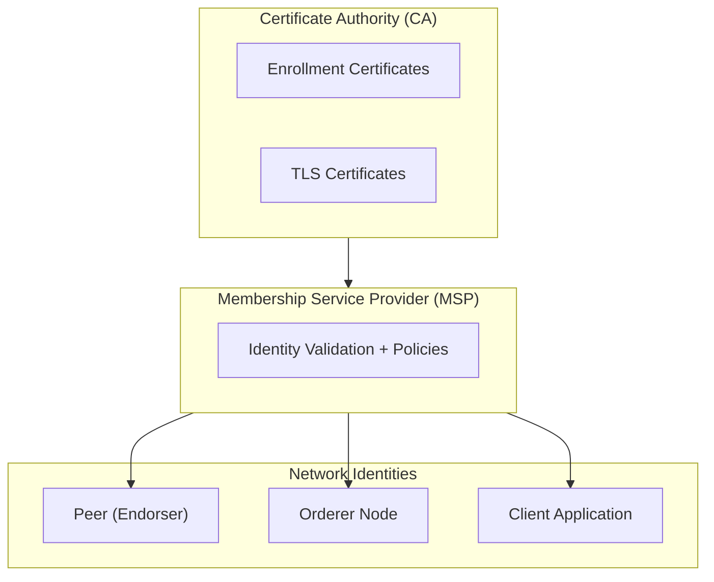

# Membership in Hyperledger Fabric

Membership is about **identities** in a Fabric network.  
It ensures only authorized participants (orgs, peers, clients, orderers) can interact.

---

## 🔹 MSP (Membership Service Provider)
- MSP is the **component that defines rules and policies for identities** in Fabric.  
- It manages how certificates are issued, validated, and revoked.  
- Each **organization** has its own MSP.  
- MSP maps identities (certificates) to roles:
  - **Client** → submits transactions.
  - **Peer (Endorser/Committer)** → endorses or commits transactions.
  - **Orderer** → orders transactions into blocks.

---

## 🔹 CA (Certificate Authority)
- A **CA** issues certificates that identify participants in the network.  
- Certificates are X.509 digital certificates.  
- Types of CAs:
  - **Fabric CA** → default CA provided by Hyperledger.
  - **External CA** → organizations can use their own PKI / enterprise CA instead.

---

## 🔹 Flow of Identity
```

CA → issues certificates → MSP → defines membership & roles → Nodes/Clients

```

1. **CA** issues:
   - Enrollment certificates (ECerts) for long-term identities.
   - TLS certificates for secure communication.
2. **MSP** validates and manages these identities.
3. Identities are assigned to roles:
   - **Endorser Peers**
   - **Orderers**
   - **Clients/Applications**

---

## ✅ Example (Car Network)
- **Org1 (Manufacturer)** has its own CA and MSP.  
- **Org2 (Dealer)** has its own CA and MSP.  
- Each org’s peers, orderers, and client apps use certificates issued by their org’s CA.  
- When `DealerApp` submits a transaction, its certificate is checked against the MSP of Org2 and the channel MSP to confirm:
  - Is this a valid org member?  
  - Is this identity authorized to act as a client?  

---

## 📝 Key Points
- **MSP = policies & rules** about identities.  
- **CA = source of identities** (issues certs).  
- **External CAs** can replace Fabric CA if orgs already have PKI.  
- Without valid MSP + CA setup, no one can join the network or submit/endorse transactions.
---

**Mermaid diagram** 

`CA → MSP → Endorser, Orderer, Client`

---


## 🔹 Membership Flow (CA → MSP → Roles)



### 📝 How to read this:
1. **CA** issues X.509 certificates (ECerts + TLSCerts).  
2. **MSP** takes those certs and applies membership rules (who belongs, who can endorse, who can order).  
3. The **roles** (Endorsers, Orderers, Clients) use these validated identities to participate in the network.  

