# Hyperledger Fabric — Transaction Flow (Endorse / Order / Commit)

This document explains how data (transactions) enters the Fabric ledger, from client app to committed state, with the endorsement → ordering → validation/commit phases.

---

## Key concepts (short)
- **Client / App (SDK)** — submits transaction proposals and submits endorsed transactions to the ordering service.  
- **Endorsing Peer (endorser)** — simulates the transaction by executing chaincode, produces read/write sets (RWSet) and signs an endorsement. An organization may host one or more endorsing peers.  
- **Orderer / Ordering Service** — collects endorsed transactions, orders them into blocks (consensus), and delivers blocks to peers.  
- **Committing Peers** — receive ordered blocks, validate each transaction (endorsement policy, MVCC read-version checks), and commit valid transactions to the ledger and update world state.  
- **Chaincode** — business logic executed during endorsement simulation.  
- **RWSet** — read set and write set produced during simulation; used for MVCC checks.

---

## Transaction flow: step-by-step

1. **Client (App / SDK) → Proposal**
   - Client constructs a **transaction proposal** (invoke + parameters) and sends this proposal to the set of **endorsing peers** defined by the chaincode’s endorsement policy.

2. **Endorsing peers → Simulate & produce RWSet**
   - Each endorser **executes chaincode** (simulation/read-only) against its local world state (no ledger commits).
   - Execution produces a **ReadSet** (keys + versions read) and a **WriteSet** (keys + new values), together called the **RWSet**.
   - Endorsing peer signs the proposal response (endorsement) containing the RWSet and returns it to the client.

3. **Client collects endorsements**
   - The client SDK collects the required endorsements (signatures + RWSet) as per the endorsement policy.
   - The client validates endorsements locally (optional best-practice) and packages the endorsed transaction.

4. **Client → Ordering Service**
   - The client sends the **endorsed transaction** (payload + collected endorsements) to the **ordering service** (via SDK).
   - The ordering service does **not** execute chaincode — it only orders transactions.

5. **Ordering Service → Blocks**
   - The ordering service runs consensus (e.g., Raft) and batches ordered transactions into **blocks**.
   - Blocks are delivered to all peers in the channel (both endorsing peers and non-endorsing peers).

6. **Peers receive block → Validate each transaction**
   - Upon receiving a block, each peer performs **validation** for each transaction:
     - **Endorsement policy check** — ensure required endorsements exist and are valid.
     - **MVCC / Read-version check** — compare the ReadSet versions against the current world state versions to detect conflicts (concurrency).
     - **Other checks** (e.g., signature format, access control) as needed.
   - Transactions failing validation are flagged invalid (but still recorded on the block).

7. **Commit block & update world state**
   - The peer commits the block to its **blockchain** (immutable transaction log).
   - For each **valid** transaction, the peer applies the WriteSet to its **world state DB** (LevelDB/CouchDB), updating key versions.
   - Invalid transactions are recorded but their writes are **not applied** to the world state.

8. **Eventing & notification**
   - Peers can emit events (block events, chaincode events) so clients and external systems can react (e.g., update UI, trigger off-chain processes).

---

## Important clarifications / notes
- **Endorsers vs committer peers**: Not every peer must be an endorser. A network can have endorsing peers and non-endorsing peers; endorsement policy decides which orgs/peers must endorse.  
- **RWSet versioning**: MVCC (multi-version concurrency control) prevents lost updates — if the version read by the simulation changed before commit, the transaction is invalidated.  
- **Ordering service role**: ordering is **consensus + sequencing** only — it does not validate or execute chaincode.  
- **Invalid txs are recorded**: even invalid transactions are logged in the blockchain for auditability but their writes are not applied.  
- **Private data collections**: for private data, endorsers holding private data exchange/transmit it off-ledger to authorized peers; the ledger stores only a hash to prove correctness while actual private payload is kept off-chain or in transient/private stores.

---

## Simple Mermaid diagram (overview)

```mermaid
flowchart TD
    %% Step 1: Client sends proposal
    Client["1️⃣ Client App (SDK)\n(submit proposal)"]

    %% Step 2: Endorsers simulate and return RWSet
    End1["2️⃣ Endorsing Peer A\n(simulate → RWSet, sign)"]
    End2["2️⃣ Endorsing Peer B\n(simulate → RWSet, sign)"]

    %% Step 3: Client collects endorsements
    Collect["3️⃣ Client collects endorsements\n(RWSet + signatures)"]

    %% Step 4: Client submits txn to orderer
    Orderer["4️⃣ Ordering Service\n(order & batch txns into blocks)"]

    %% Step 5: Peers validate and commit
    Peer1["5️⃣ Peer (validate endorsement policy,\nMVCC check, commit block)"]
    Peer2["5️⃣ Peer (validate endorsement policy,\nMVCC check, commit block)"]

    %% World State DBs
    DB1["6️⃣ World State DB (replica)\n(update valid writes)"]
    DB2["6️⃣ World State DB (replica)\n(update valid writes)"]

    %% Flow connections
    Client --> End1
    Client --> End2
    End1 --> Collect
    End2 --> Collect
    Collect --> Orderer
    Orderer --> Peer1
    Orderer --> Peer2
    Peer1 --> DB1
    Peer2 --> DB2

````

---

## Troubleshooting tips

* If transactions are repeatedly invalidated by MVCC, check for high concurrency or re-sequence conflicting updates (use optimistic locking or restructure writes).
* If endorsements are missing/insufficient, ensure chaincode endorsement policy matches available endorsers and that peers are up and reachable.
* Use peer logs and block events (peer deliver service) to debug ordering/validation/commit problems.

---

## Quick checklist when designing chaincode & network

* Design endorsement policies that reflect real trust model but avoid unnecessary wide endorsement (impacts latency).
* Keep heavy computation off-chain where possible; chaincode should be deterministic and efficient.
* Use private data collections for sensitive fields rather than storing everything in world state.
* Choose CouchDB when you need rich JSON queries; LevelDB for simple key-value access.

----------------------

Let’s make a concrete example with **car supply chain example**. This will walk through the full **Hyperledger Fabric transaction flow** using “Car” assets instead of abstract terms.

---

# 🚘 Car Example — Transaction Flow in Hyperledger Fabric

Imagine we have a channel with **Org1 (Manufacturer)** and **Org2 (Dealer)**.
We define a chaincode function: `createCar(carID, make, model, owner)`.

---

## ✅ Step-by-Step Flow

### 1. Client (Dealer app) submits proposal

The Dealer’s application (via Fabric SDK) wants to create a car record:

```js
// Dealer app
await contract.submitTransaction("createCar", "CAR100", "Toyota", "Corolla", "DealerA");
```

👉 This proposal is sent to **endorsing peers** from both Org1 and Org2 (per endorsement policy).

---

### 2. Endorsing peers simulate

Each endorsing peer runs the chaincode in **simulation mode**:

```go
func (s *SmartContract) CreateCar(ctx contractapi.TransactionContextInterface, carID, make, model, owner string) error {
    car := Car{Make: make, Model: model, Owner: owner}
    carJSON, _ := json.Marshal(car)
    return ctx.GetStub().PutState(carID, carJSON)
}
```

* **RWSet generated**:

  ```json
  {
    "read_set": [],
    "write_set": [
      {"key":"CAR100","value":{"make":"Toyota","model":"Corolla","owner":"DealerA"}}
    ]
  }
  ```

👉 No ledger update yet — just simulation.
👉 Endorsers sign this RWSet and return to client.

---

### 3. Client collects endorsements

Dealer app gathers signed endorsements from Org1 and Org2 peers.
If they match the endorsement policy, the app packages them into a transaction.

---

### 4. Client submits to Ordering Service

The packaged transaction (with RWSet + endorsements) is sent to the **ordering service**.
Orderer batches it into a block with other transactions.

---

### 5. Orderer delivers block

Block is sent to **all peers** in Org1 and Org2.
⚠️ Orderer does **not** check if the car already exists.

---

### 6. Peers validate transactions

Each peer validates:

* ✅ Endorsement policy satisfied?
* ✅ RWSet Read versions still valid? (MVCC check)

Example:

* If another transaction already created `CAR100`, this transaction fails **MVCC check** → marked **INVALID**.

---

### 7A. Valid case

If `CAR100` does not exist yet:

* Transaction marked **valid**.
* Car is added to **ledger** and **world state DB**:

**World State after commit (CouchDB):**

```json
{
  "CAR100": {
    "make": "Toyota",
    "model": "Corolla",
    "owner": "DealerA"
  }
}
```

---

### 7B. Invalid case

If two apps submit `CAR100` at the same time:

* The **first transaction** wins, car created.
* The **second transaction** fails MVCC (key already written).
* Blockchain block contains both transactions:

  * Tx1 = VALID ✅
  * Tx2 = INVALID ❌

👉 **Ledger** (immutable history): both Tx1 and Tx2 recorded.
👉 **World state DB**: only Tx1 applied, car exists once.

---

## ✅ Diagram (Car Example)

```mermaid
flowchart TD
    Client["1️⃣ Dealer App (SDK)\nsubmit createCar(CAR100)"]

    End1["2️⃣ Endorser Org1 (Manufacturer)\nsimulate chaincode, RWSet"]
    End2["2️⃣ Endorser Org2 (Dealer)\nsimulate chaincode, RWSet"]

    Collect["3️⃣ Client collects endorsements\n+ RWSet signatures"]

    Orderer["4️⃣ Ordering Service\n(order & batch into blocks)"]

    Peer1["5️⃣ Org1 Peer\nvalidate endorsements + MVCC"]
    Peer2["5️⃣ Org2 Peer\nvalidate endorsements + MVCC"]

    Valid["6️⃣ VALID Txn → Ledger + World State\n(Car created)"]
    Invalid["❌ INVALID Txn → Ledger only\n(no state update)"]

    Client --> End1
    Client --> End2
    End1 --> Collect
    End2 --> Collect
    Collect --> Orderer
    Orderer --> Peer1
    Orderer --> Peer2
    Peer1 --> Valid
    Peer2 --> Valid
    Peer1 --> Invalid
    Peer2 --> Invalid
```



---

## 🔑 Key Takeaways for Cars

* **World state** = current car registry (latest owner, attributes).
* **Ledger** = full history (who created, transferred, or invalid attempts).
* **Invalid txns** still appear in ledger (audit trail) but do not affect car ownership.
* **MVCC** ensures no two dealers can “create” the same car ID simultaneously.

---


